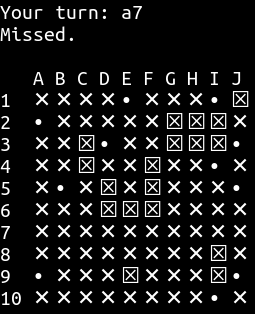
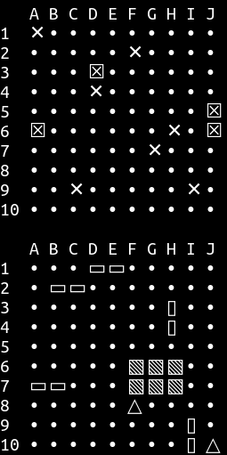

## Battleship 🚢

[Battleship game](https://en.wikipedia.org/wiki/Battleship_(game)) implemented in Rust.


Fully playable between 2 players on the terminal.

### Building

Minimum supported Rust version: `1.38.0`

```shell-session
$ cargo build --release
```

### Running

```shell-session
$ ./target/release/battleship
```

This will start the server on port `1234`, then players can connect to it with any tool that supports TCP sockets. For example, using [netcat](https://en.wikipedia.org/wiki/Netcat):

```shell-session
$ nc 127.0.0.1 1234
```

### Docker

[Dockerfile](./Dockerfile) is available in the repository.

#### Building

```shell-session
$ docker build -t battleship .
```

#### Running

```shell-session
$ docker run --rm -d --name battleship -p 1234:1234 battleship
```

### Configuring

You can use the following environment variables for specifying the game settings:

- `BATTLESHIP_SOCKET`: TCP socket address (default: `127.0.0.1:1234`)
- `BATTLESHIP_GRID_WIDTH`: Width of the game grid (default: `10`)
- `BATTLESHIP_GRID_HEIGHT`: Height of the game grid (default: `10`)

### Playing

After joining the game, players take turns firing shots (by calling out a grid coordinate) to attempt to hit the opponent's enemy ships. Example coordinates would be `a1`, `g8`, `E4`, `I2`, and so on.



Each player has two grids: an upper and lower grid.



The lower grid views the location of the player's own ships, while the upper grid shows the shots fired toward the opponent and also gives information about whether those shots were hits or misses.

- `☒`: hit
- `✕`: missed

#### Ship types

1. Boat

```
△
```

2. Destroyer

```
▯
▯
```

3. Battleship

```
▧▧
▧▧
▧▧
```

### License

<sup>
All code is licensed under <a href="LICENSE">The MIT License</a>.
</sup>
